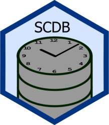

<!-- README.md is generated from README.Rmd. Please edit that file. -->

# SCDB <a href="https://ssi-dk.github.io/SCDB/"></a>

<!-- badges: start -->

[](https://CRAN.R-project.org/package=SCDB)
[](https://github.com/ssi-dk/SCDB/actions/workflows/all-workflows.yaml)
[](https://app.codecov.io/gh/ssi-dk/SCDB)

<!-- badges: end -->

## Overview

`SCDB` is a package for easily maintaining and updating data with a
slowly changing dimension. More specifically, the package facilitates
type-2 history for data warehouses and provide a number of
quality-of-life improvements for working with SQL databases within R.

To better understand what a slowly changing dimension is and how and
this packages provides it, see `vignette("basic-principles")`.

## Installation

``` r
# Install SCDB from CRAN:
install.packages("SCDB")

# Alternatively, install the development version from github:
# install.packages("devtools")
devtools::install_github("ssi-dk/SCDB")
```

## Usage

For basic usage examples, see `vignette("basic-principles")`.

## Installation

``` r
# Install SCDB from CRAN:
install.packages("SCDB")

# Alternatively, install the development version from github:
# install.packages("devtools")
devtools::install_github("ssi-dk/SCDB")
```

## Usage

For basic usage examples, see `vignette("SCDB")`.
